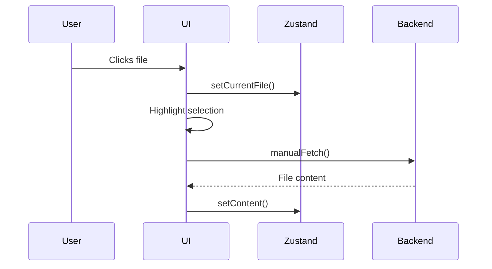
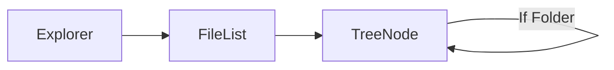

# Anatomy of a Modern File Explorer: How React and Zustand Power File Navigation

## 1. Core Architecture

The system is built on three key layers:


## 2. The File Selection Pipeline

Here's what happens when a user clicks a file:



Phase Breakdown
1. User Action: Triggers the selection chain

2. State Update: Zustand stores the selected file

3. Visual Feedback: UI highlights the file instantly

4. Content Load: Fetches data asynchronously

## 3. State Management Design
Zustand Store Structure

```ts
type Store = {
  folders: FolderType[]     // File tree structure
  currentFile: string      // Active file
  actions: {
    setCurrentFile: (name: string) => void
    addFileToPath: (path: string[], name: string) => void
    // ...other CRUD operations
  }
}
```
Local UI State
```tsx
const [selectedPath, setSelectedPath] = useState([]) // Currently selected file
const [collapsedFolders, setCollapsedFolders] = useState(new Set()) // Folder toggle state
```
## 4. File Tree Rendering
The explorer uses recursive components to render nested folders:


### Key Algorithms
1. Path-Based Lookups

```ts
findFolder(folders, ['src', 'components']) 
// Returns the 'components' folder
```
2. Collapse/Expand
Managed via a Set of path strings for O(1) lookups

## 5. Performance Considerations
* Optimizations Implemented
Memoized Components: Prevent re-renders of unchanged files

* Batched Updates: Zustand merges state changes

* Lazy Content Loading: Files load only when selected

### Tradeoffs

| Approach         | Pros        | Cons             |
| ---------------- | ----------- | ---------------- |
| Recursive Tree   | Simple code | Deep updates re-render entire branches |
| Path-Based State | Fast lookups| Requires careful synchronization |


## 6. Error Boundaries
* The system gracefully handles:

* Missing files

* Failed content fetches

* Invalid paths

```ts
try {
  const content = await manualFetch(fileName)
} catch {
  showToast('Failed to load file')
}
```
### Conclusion
**Separation of Concerns:** UI, state, and IO are cleanly separated

**Predictable Updates:** Zustand ensures single source of truth

**User Experience:**

 Instant visual feedback with background loading

This mirrors how modern IDEs (like VSCode) and OS file explorers manage complexity while staying responsive. The key innovation is balancing synchronous state updates with asynchronous operations—a pattern now common in web and native apps alike.
